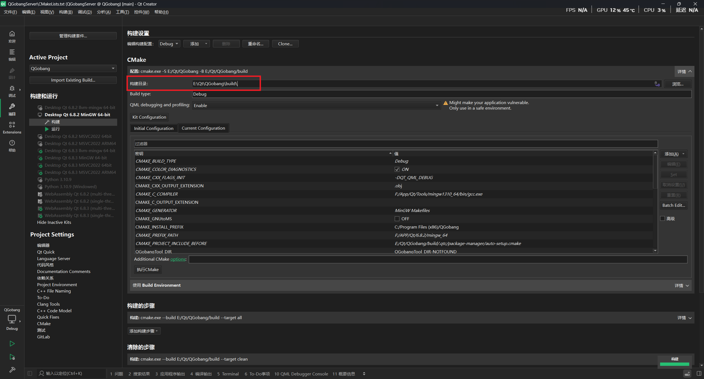

由于时间为凌晨四点, 暂时不写那么多

当前用于简单描述该项目, 后续更新readme

此项目整体设计模式为单例设计模式, 请大家注意该设计模式
项目暂时为Qt6 qmake 开发设计
请在编译项目时, 根据如下图所示, 关闭指定编译目录

项目过程中, 请保持统一命名空间,
例如开发QGobangClient中, 请将类添加至NS_QGobangClient命名空间中, 其中NS为Namespace的简写

然后命名方式大多为小驼峰
文件名为大驼峰, 
例如CUiManger.h, C表示Class的简写

成员变量请以m_<类型>开始
例如整形 m_iNumber
字符串 m_sStr
类变量 m_pClass

函数体中为 iNumber, sStr, pClass

QGobang将采用的是`GPLv3`许可证进行开源
